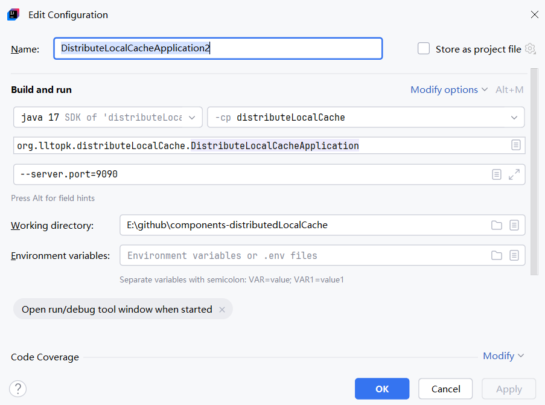

本项目利用redis的消息发布订阅模式, 实现了分布式的本地缓存的一致性

由于不需要redis缓存, 也就节省了每次网络请求的开销, 因此本地缓存的性能是很高的

## 连接性验证
1. 运行主应用, [TestConnection.java](distributeLocalCache/src/main/java/org/lltopk/distributeLocalCache/mock/TestConnection.java)会执行缓存测试
2. 单元测试: [AbstractGuavaCacheTest.java](distributeLocalCache/src/test/java/org/lltopk/distributeLocalCache/cache/AbstractGuavaCacheTest.java)

## 模拟分布式节点
模拟两个分布式节点, 主应用默认端口号8080, IDEA复制主应用, 修改应用2端口号为9090

```shell
Program arguments:--server.port=9090
```



## 本地缓存结构
使用guava, 缓存默认懒加载, 当get不到的时候, 执行回调加载数据库缓存
```java
    // LoadingCache methods

    V getOrLoad(K key) throws ExecutionException {
        return get(key, defaultLoader);
    }
```
其中defaultLoader是builder建造者构建的时候, 传入的自定义回调函数
```java
  public <K1 extends K, V1 extends V> LoadingCache<K1, V1> build(
        CacheLoader<? super K1, V1> loader) {
    checkWeightWithWeigher();
    return new LocalCache.LocalLoadingCache<>(this, loader);
  }
```

继续追踪源码, 回调函数在LocalCache.java中被执行
```java
    public ListenableFuture<V> loadFuture(K key, CacheLoader<? super K, V> loader) {
      try {
        stopwatch.start();
        V previousValue = oldValue.get();
        if (previousValue == null) {
          V newValue = loader.load(key);
          return set(newValue) ? futureValue : Futures.immediateFuture(newValue);
        }
        ListenableFuture<V> newValue = loader.reload(key, previousValue);
        if (newValue == null) {
          return Futures.immediateFuture(null);
        }
        // To avoid a race, make sure the refreshed value is set into loadingValueReference
        // *before* returning newValue from the cache query.
        return transform(
            newValue,
            new com.google.common.base.Function<V, V>() {
              @Override
              public V apply(V newValue) {
                LoadingValueReference.this.set(newValue);
                return newValue;
              }
            },
            directExecutor());
      } catch (Throwable t) {
        ListenableFuture<V> result = setException(t) ? futureValue : fullyFailedFuture(t);
        if (t instanceof InterruptedException) {
          Thread.currentThread().interrupt();
        }
        return result;
      }
    }
```


## 频道自动装配
Redis 的 Pub/Sub：频道不需要提前创建, 发布消息也不会创建频道

因此配置要比mq简单的多, 只需要给订阅者指定监听的频道即可, redis会自动管理

启动服务之后, 可以在redis-cli控制台执行pubsub channels验证当前自动生成的所有订阅者频道
```java
@Configuration
public class RedisPubSubConfig {
    @Autowired
    List<ILocalCacheSubscriber> localCacheSubscribers;

    /**
     * @param connectionFactory
     * @return
     */
    @Bean
    public RedisMessageListenerContainer container(RedisConnectionFactory connectionFactory) {
        RedisMessageListenerContainer container = new RedisMessageListenerContainer();
        container.setConnectionFactory(connectionFactory);
        for (ILocalCacheSubscriber localCacheSubscriber : localCacheSubscribers) {
            container.addMessageListener(localCacheSubscriber, new ChannelTopic(localCacheSubscriber.topic()));
        }
        return container;
    }
}
```

## 业务逻辑
根据单一职责, 设计三个接口:
- [ILocalCacheAccess.java](distributeLocalCache/src/main/java/org/lltopk/distributeLocalCache/cache/ILocalCacheAccess.java)
- [ILocalCachePublisher.java](distributeLocalCache/src/main/java/org/lltopk/distributeLocalCache/cache/ILocalCachePublisher.java)
- [ILocalCacheSubscriber.java](distributeLocalCache/src/main/java/org/lltopk/distributeLocalCache/cache/ILocalCacheSubscriber.java)

分别是缓存的基本访问CRUD功能, 发布频道消息功能, 订阅频道接口消息功能

抽象类[AbstractGuavaCache.java](distributeLocalCache/src/main/java/org/lltopk/distributeLocalCache/cache/AbstractGuavaCache.java)实现上述三个接口

核心的业务逻辑有以下几个
- 每个客户端生成默认的节点标识instanceId, 如UUID.randomUUID().toString()
- 当有客户端发布频道消息的时候, 各大服务节点监听消息, 清空各自的本地缓存, 但要注意根据instanceId跳过自己的节点
- 当有客户端更新本地缓存的时候, 触发发布频道消息, 用于同步各大节点本地缓存一致性

## redis原生命令
进入redis容器
```shell
[root@192 ~]# docker exec -it redis /bin/bash
root@9449807b3731:/data# ls
appendonly.aof  dump.rdb
root@9449807b3731:/data# redis-cli
```

PUBLISH <channel> <message>命令用于发布消息, 其返回值是可以接收消息的客户端数量
```shell
127.0.0.1:6379> pubsub channels
1) "BizStringCache"
2) "BizListCache"
127.0.0.1:6379> pubsub channels
(empty array)
127.0.0.1:6379> pubsub channels
1) "BizStringCache"
2) "BizListCache"
127.0.0.1:6379> pubsub channels
1) "BizStringCache"
2) "BizListCache"
127.0.0.1:6379> PUBLISH BizStringCache "key1"
(integer) 1
127.0.0.1:6379> pubsub channels
1) "BizStringCache"
2) "BizListCache"
127.0.0.1:6379> PUBLISH BizStringCache "key1"
(integer) 1
127.0.0.1:6379> PUBLISH BizStringCache "key1"
(integer) 2
127.0.0.1:6379> PUBLISH BizListCache "key1"
(integer) 2
127.0.0.1:6379> PUBLISH BizMapCache "key1"
(integer) 0
127.0.0.1:6379> PUBLISH BizMapCache "key1"
(integer) 2
127.0.0.1:6379> PUBLISH BizMapCache "refresh"
(integer) 2
127.0.0.1:6379> pubsub channels
1) "BizMapCache"
2) "BizStringCache"
3) "BizListCache"
```

> 在Linux命令文档/帮助的语法说明里 
> 方括号 [ ]：表示可选项。出现在方括号里的内容可以不写。 例：command [options] <file> 表示 options 是可选的。 
> 尖括号 < >：表示必填的占位符，需要你用实际值替换，括号本身不输入。 例：cp <源文件> <目标路径> 实际输入应是 cp src.txt /tmp/

## 测试验证

见[controller](distributeLocalCache/src/main/java/org/lltopk/distributeLocalCache/controller)